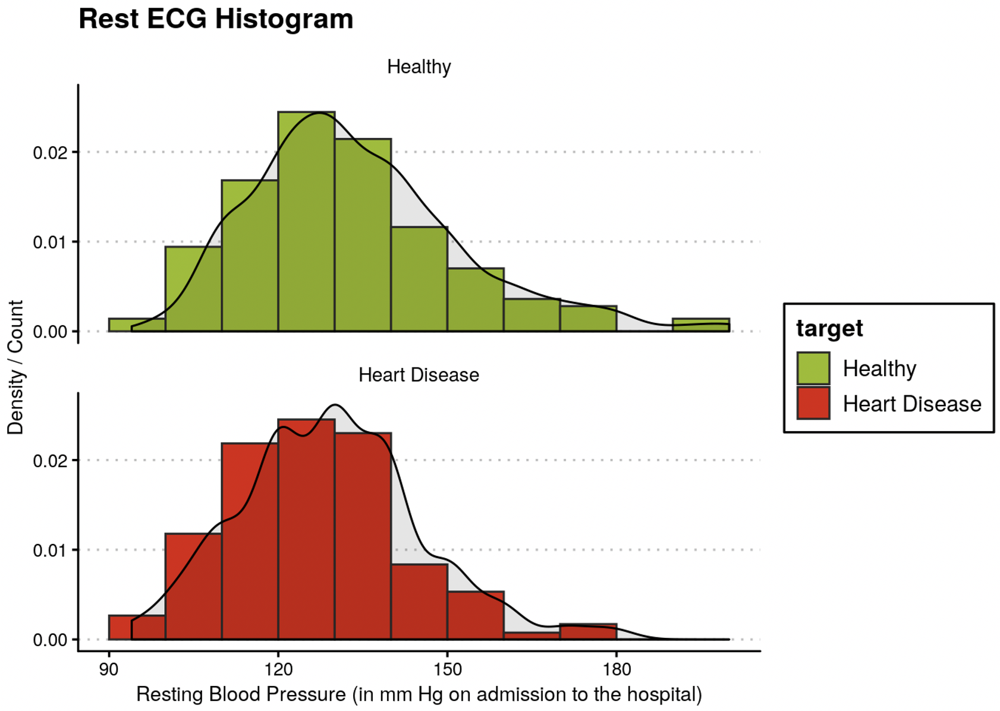
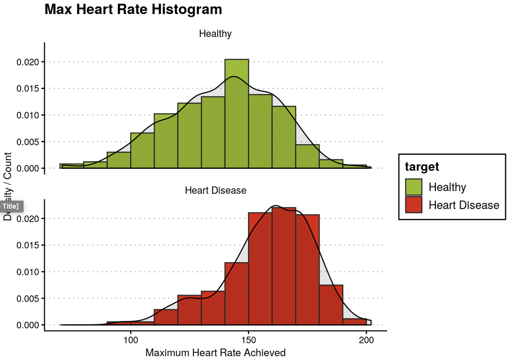

# Heart-Disease-Risk-Prediction

<!-- PROJECT SHIELDS -->
[![Contributors][contributors-shield]][contributors-url]

[![MIT License][license-shield]][license-url]

## Overview

Photo by <a href="https://unsplash.com/@alexacea?utm_source=unsplash&amp;utm_medium=referral&amp;utm_content=creditCopyText">Alexandru Acea</a> on <a href="https://unsplash.com/s/photos/heart?utm_source=unsplash&amp;utm_medium=referral&amp;utm_content=creditCopyText">Unsplash</a>

* It is a well-known fact that Heart Diseases are currently the leading cause of death across the world. 

* The development of a computational system that can predict the presence of heart diseases will significantly reduce the mortality rates & substantially reduce the costs of health care.

* Such information is predicted well in advance, can provide important insights to doctors.

* For more information regarding this project. - [Click here.](https://maharshsuryawala.github.io/Heart-Disease-Risk-Prediction/)

## Dataset

Source: [UCI Heart Disease Dataset](https://archive.ics.uci.edu/ml/datasets/Heart+Disease)
  
  * Each data-set from Cleveland, Hungary, Switzerland, and Long-Beach consisted of 76 attributes.
  * However, it is recommended to use only 14 for our analysis.
  * Moreover, later we will find out that only 6 attributes have a  significant effect. 
  * In this notebook, classifiers were built using one combined dataset and the performance evaluation is carried out using cross-validation techniques. 
  * In addition to this, heart-disease prediction is carried out using logistic regression, random forest, neural-network, and decision tree. 

## Inferences derived from Exploratory Data Analysis. 

Total number of observations of healthy people and people suffering from heart-diseases.

It can be observed that heart disease is uniformly spread out across age. In addition to that the median age for patients estimated was 56 with youngest and oldest being 29 and 77, respectively. 

It can be observed from the plots that the median age of the people exhibiting heart diseases is less than the healthy ones. Moreover, it can be observed that the distribution of patients exhibiting heart diseases is slightly skewed. Hence, we can use age as a predictive feature.

It can be observed that there is no major difference between the distributions of Rest ECG of healthy people and the ones exhibiting heart diseases.

Moreover, it can be observed here that majority of the people exhibiting heart diseases have their serum cholesterol in the range of 200 - 300 mg/dl

People exhibiting heart diseases generally have higher maximum heart rates as compared to health people.  

Majority of heart diseased patients have ST-Depression of 0.1

Most of the people who have 0-Major vessels are suffering from heart diseases

Heart diseases among females are higher as compared to males. 

Majority of people suffering from heart-diseases have chest pain of type 1 or 2. 

No major difference in fasting blood sugar. 

People having Rest ECG-1 have a higher probability of suffering from heart diseases.

People with No exercise induced angina have a higher probability of getting heart diseases.

People with Peak Exercise slope 2 have a higher probability of exhibiting heart diseases.

People with 
fixed defect Thalassemia have a higher probability to suffer from heart diseases

It can be observed that only a few parameters such as Chest pain type, Gender, Exercise induced angina, Number of vessels, and ST depression have a significant effect. Hence, dropping other parameters

## Results

* Logistic Regression 
  * Accuracy: 78.54%
  * Sensitivity: 84.77%
  * Specificity: 72%

* Random Forest 
  * Accuracy: 89.76%
  * Sensitivity: 85.59%
  * Specificity: 95.4%

* Neural Network 
  * Accuracy: 81.95%
  * Sensitivity: 76.98%
  * Specificity: 89.87%

* Decision Tree 
  * Accuracy: 86.65%
  * Sensitivity: 81.4%
  * Specificity: 87.56%

<!-- CONTRIBUTING -->
## Contributing  

Any contributions you make are **greatly appreciated**.

1. Fork the Project
2. Create your Feature Branch (`git checkout -b feature/amazing-feature`)
3. Commit your Changes (`git commit -m 'feat: some amazing feature'`)
4. Push to the Branch (`git push origin feature/amazing-feature`)
5. Open a Pull Request

<!-- LICENSE -->
## License

Distributed under the MIT License. See `LICENSE` for more information.

<!-- CONTACT -->
## Contact
 

Maharsh Suryawala - [Portfolio](https://maharshsuryawala.github.io/maharshsuryawala/)

Project Link: [https://github.com/MaharshSuryawala/Microprocessor-Without-Interlocked-Pipeline-Stages-MIPS](https://github.com/MaharshSuryawala/Microprocessor-Without-Interlocked-Pipeline-Stages-MIPS)

<!-- ACKNOWLEDGEMENTS -->
## Acknowledgements
* [Img Shields](https://shields.io)
* [Iconify](https://iconify.design/)
* [MIT License](https://opensource.org/licenses/MIT)
* [Unsplash](https://unsplash.com/)
* [Badgen](https://badgen.net/)
* [For The Badge](https://forthebadge.com/)

<!-- MARKDOWN LINKS -->
<!-- https://www.markdownguide.org/basic-syntax/#reference-style-links -->
[contributors-shield]: https://img.shields.io/github/contributors/MaharshSuryawala/Microprocessor-Without-Interlocked-Pipeline-Stages-MIPS?style=flat-square 
[contributors-url]: https://github.com/MaharshSuryawala/Microprocessor-Without-Interlocked-Pipeline-Stages-MIPS/graphs/contributors
[license-shield]: https://img.shields.io/github/license/MaharshSuryawala/Heart-Disease-Risk-Prediction?style=flat-square?style=flat-square
[license-url]: https://github.com/MaharshSuryawala/Heart-Disease-Risk-Prediction?style=flat-square/blob/master/LICENSE.txt
